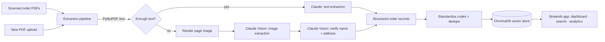

# Order Intelligence

**An AI pipeline that turns scanned paper order forms into a searchable, analyzable order database.** Built end-to-end for a real small business, then anonymized and genericized for public sharing.

`Claude Vision extraction` · `ChromaDB vector store` · `Streamlit ops UI` · `Python`

---

## The problem

A small member-based collective took orders on **paper forms**, scanned in bulk to PDF — hundreds of low-quality Adobe Scans a week. Turning that into fulfillment and business insight meant a person retyping every slip by hand: customer, shipping address, products, quantities, totals. It didn't scale, it was error-prone, and the owner had no visibility into their own business.

**This system reads the scans automatically** and gives the owner a database and dashboard they actually use.

## What it does

- **Extracts** structured order data from garbage-quality scanned PDFs using a hybrid text + Claude Vision pipeline, with a second-pass vision check on the fields that matter most (names, addresses).
- **Standardizes** 240+ OCR product-code variants down to a clean product catalog, and deduplicates line items into orders.
- **Stores** every record in a **ChromaDB** vector database for full-text and semantic search.
- **Serves** an operator-facing **Streamlit** app: KPI dashboard, revenue/product/loyalty analytics, order search, and a live "upload a PDF → watch Claude extract it" flow.

## Architecture



## The AI pipeline

Each page is processed with a **hybrid strategy** (`app/extraction.py`):

1. **Text first.** PyMuPDF pulls any embedded text. A heuristic decides whether it's rich enough (keyword density, presence of currency/dates/emails) to extract from directly.
2. **Vision fallback.** If the text is thin — the common case for photographed/scanned forms — the page is rendered to a high-DPI image, sharpened, and sent to **Claude** as an image with a strict JSON schema.
3. **Second-pass verification.** Customer name and shipping address (the highest-cost fields to get wrong) are re-checked against the image in a focused follow-up call.

The model returns a strict JSON array of line items; each is tagged with its source file and page for provenance.

## Data & privacy

The dataset in this repo is **synthetic and non-reversible** — and the anonymization is itself part of the engineering story:

- **No reversible mapping.** Fake identities are assigned by cryptographically-seeded random draw, not derived from real names. There is deliberately no `fake = f(real_name)` function anyone could recompute to test whether a real person appears in the data.
- **Consistent per customer.** Each real customer maps to exactly one fake identity, so repeat-buyer counts and lifetime-value analytics are preserved.
- **No silent merges.** Fake names are guaranteed unique, so two real customers never collapse into one.
- **Coarsened geography.** ZIPs are truncated to 3-digit prefixes (HIPAA safe-harbor style); street addresses are synthetic; apartment/unit lines are dropped.
- **Organization genericized.** The client's name and real product names never appear. Product descriptions are *generated* from a fictional catalog, not scrubbed from the source — so no product or ingredient signal can leak regardless of OCR noise.

See `scripts/anonymize.py` and `app/branding.py`.

> The real → fake mapping is written to `data/anon_mapping_private.csv`, which is **gitignored** and never committed.

## Quickstart

```bash
# 1. Environment
python3 -m venv .venv && source .venv/bin/activate
pip install -r requirements.txt

# 2. Build the vector DB from the anonymized data
python scripts/build_db.py

# 3. Run the app
streamlit run app/streamlit_app.py
```

Open http://localhost:8501.

**Live extraction** (optional) needs an Anthropic API key:

```bash
cp .env.example .env   # then paste your key into .env
```

Rebuilding the demo data from a raw export (drop it at `data/orders_raw.csv`):

```bash
python scripts/anonymize.py    # -> data/orders.csv (+ private mapping)
python scripts/build_db.py
```

## Docker

```bash
docker build -t order-intelligence .
docker run -p 8501:8501 -e ANTHROPIC_API_KEY=$ANTHROPIC_API_KEY order-intelligence
```

## Project structure

```
app/
  streamlit_app.py       Operator UI (dashboard · search · analytics · live extract)
  extraction.py          Hybrid text + Claude Vision extraction pipeline
  database_manager.py    ChromaDB CRUD, search, stats, export
  branding.py            Fictional org + product catalog (single source of truth)
data/
  orders.csv             Anonymized, genericized demo data (committed)
  orders_raw.csv         Real source data (gitignored)
scripts/
  anonymize.py           PII removal + org genericization
  build_db.py            Rebuild ChromaDB from orders.csv
requirements.txt
Dockerfile
```

## Tech stack

Claude API (vision + text extraction) · ChromaDB · Streamlit · Plotly · PyMuPDF · pandas

---

*The organization name, product catalog, and all customer identities in this repo are fictional. Built as a portfolio case study.*
